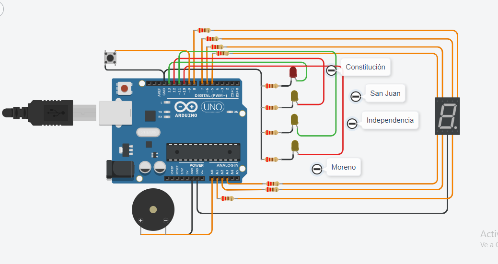

# Documentación Dojo 2


## Integrantes
* Blanco Rivas Tomas
* Campos Tomás
* Atoche Luis
* Escobar Rodrigo
* Avila Valentin

## Proyecto: Subte


## Descripción
Desarrollo de un sistema para que el usuario sepa a qué estación de subte está llegando. Muestra las estaciones que faltan para llegar a destino mediante el display de 7 segmentos.
1. El botón enciende el sistema.
2. El led se prende al llegar a la estación.
3. El buzzer emite un sonido diferente en cada estación.
  
### Materiales
* 1 ARDUINO.

* 1 DISPLAY 7 SEGMENTOS.

* 4 LEDS.

* 1 BUZZER.

* 1 BOTÓN

* RESISTENCIAS NECESARIAS PARA CADA COMPONENTE.

## Función principal
La función se encarga de enceder el display 7 segmentos junto al led correspondiente y emite un sonido diferente para cada case del switch.

numero recibe un contador que se utiliza para ingresar a las diferentes condiciones del switch.

Tanto los leds como las secciones del display inician apagadas para que solo se prendan las necesarias en cada condición y vuelvan apagarse al salir de la condición.

El buzzer prende con una frecuencia diferente en cada condición.

```C++
void PrenderSegmento(int numero, int led_uno, int led_dos, int led_tres, int led_cuatro, int buzzer)
{
  digitalWrite(A, LOW);
  digitalWrite(B, LOW);
  digitalWrite(C, LOW);
  digitalWrite(D, LOW);
  digitalWrite(E, LOW);
  digitalWrite(F, LOW);
  digitalWrite(G, LOW);
  digitalWrite(led_uno, LOW);
  digitalWrite(led_dos, LOW);
  digitalWrite(led_tres, LOW);
  digitalWrite(led_cuatro, LOW);
  
  switch(numero)
  {
    case 0:
    {
      digitalWrite(led_uno, HIGH);
      digitalWrite(A, HIGH);
      digitalWrite(B, HIGH);
      digitalWrite(C, HIGH);
      digitalWrite(D, HIGH);
      digitalWrite(G, HIGH);
      tone(buzzer, 1000);
      delay(500);
      noTone(buzzer);
      break;
    }
    case 1:
    {
      digitalWrite(led_dos, HIGH);
      digitalWrite(A, HIGH);
      digitalWrite(B, HIGH);
      digitalWrite(D, HIGH);
      digitalWrite(E, HIGH);
      digitalWrite(G, HIGH);
      tone(buzzer, 600);
      delay(500);
      noTone(buzzer);
      break;
    }
    case 2:
    {
      digitalWrite(led_tres, HIGH);
      digitalWrite(B, HIGH);
      digitalWrite(C, HIGH);
      tone(buzzer, 400);
      delay(500);
      noTone(buzzer);
      break;
    }
    case 3:
    {
      digitalWrite(led_cuatro, HIGH);
      digitalWrite(A, HIGH);
      digitalWrite(B, HIGH);
      digitalWrite(C, HIGH);
      digitalWrite(D, HIGH);
      digitalWrite(E, HIGH);
      digitalWrite(F, HIGH);
      tone(buzzer, 200);
      delay(500);
      noTone(buzzer);
      break;
    }
  }
}
```

## Link al proyecto
* [Proyecto](https://www.tinkercad.com/things/6YA66ADFYq2)
